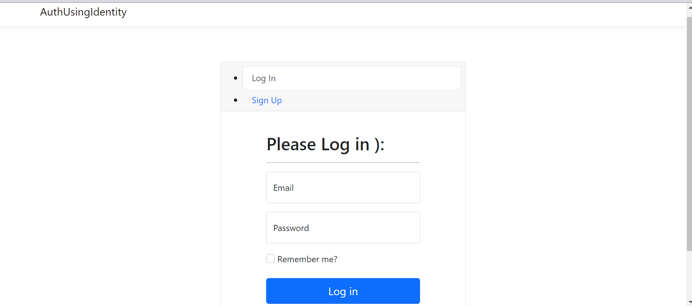
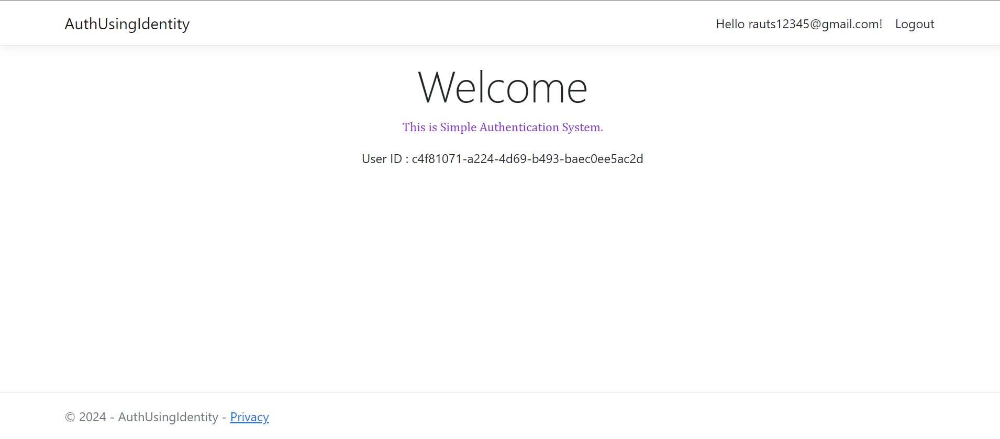

# Simple Authentication System

Welcome to our Simple Authentication System built with ASP.NET Core MVC!





## Features

- **Real-time Sign Up:** Users can sign up for a new account instantly.
- **Effortless Sign In:** Seamless sign-in process for existing users.
- **User-Friendly Interface:** Intuitive UI design for a smooth user experience.
- **Password Encryption:** Secure storage of user passwords using encryption techniques.
- **Session Management:** Efficient session handling for improved security and usability.
- **Responsive Design:** Compatible with various devices and screen sizes.

## Getting Started

Follow these steps to get the authentication system up and running on your local machine:

1. **Clone the Repository:**
   ```bash
   git clone https://github.com/DynamicGuy18/SimpleAuthSystem.git
